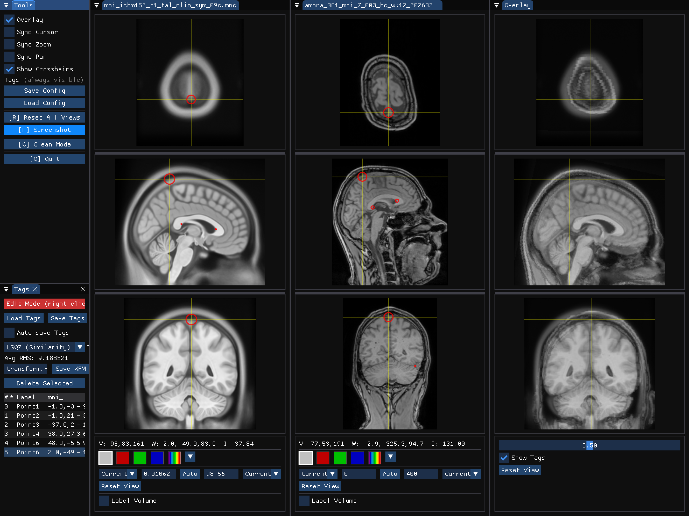
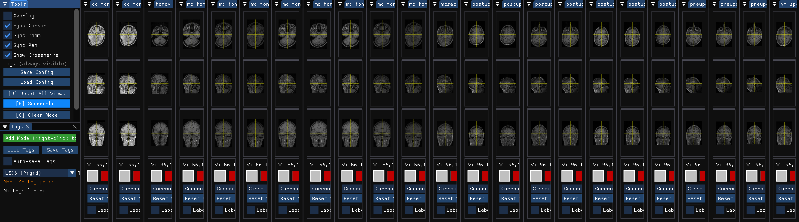
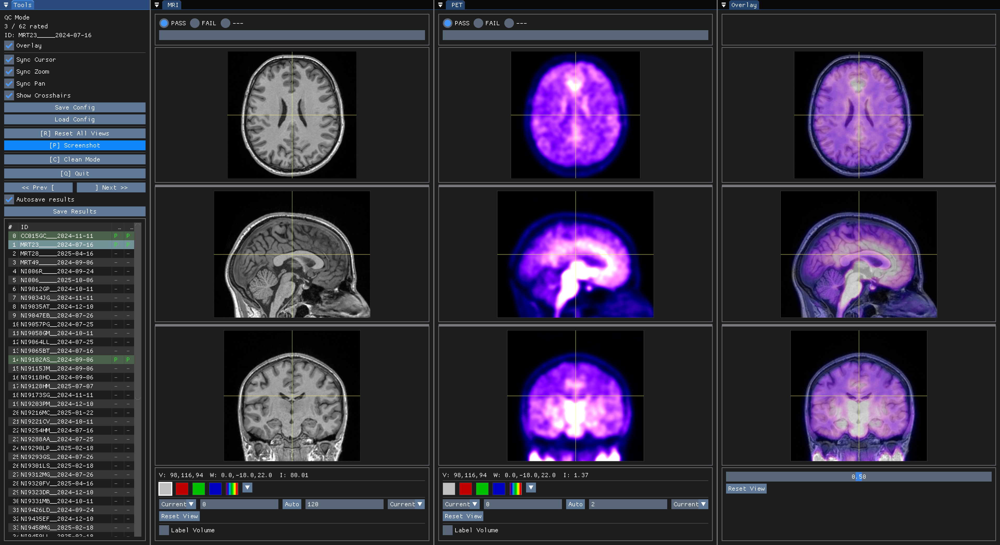

# Neuro Slop for the Neuro Science

## 100% Vibe coded register replacement, C++17 , Vulkan with OpenGL2 fallback, ImGui

Now you can open as many MRI scans at once, as your nice 50" monitor allows you

There is also a special QC mode

Original register (human coded 1993-2024): https://github.com/BIC-MNI/register , original documentation: https://en.wikibooks.org/wiki/MINC%2FVisualTools%2Fregister

**YMMV!**